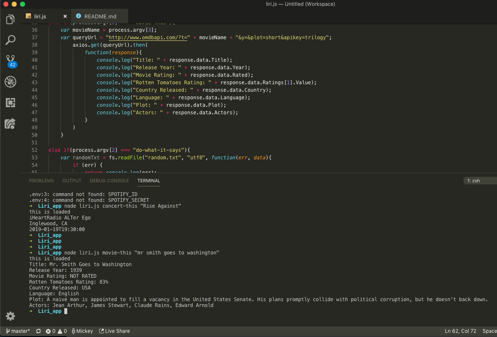
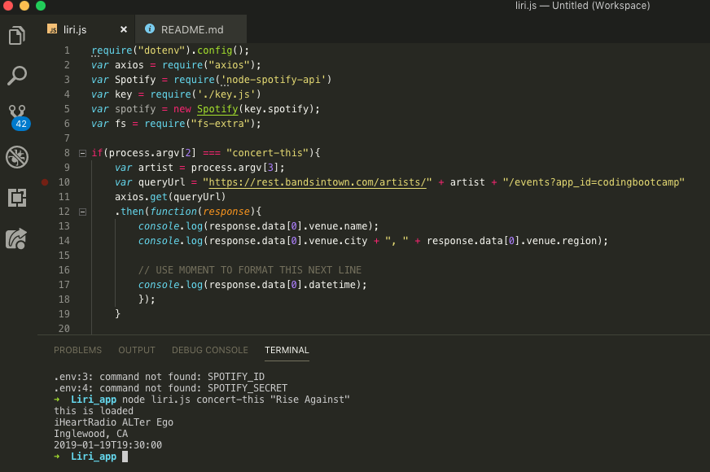

# liri-node-app

This is a program designed to use the terminal window and search for characteristics of various media. Media examples include movies, songs, and bands/artists.

This program is a useful way for users to be provided information with simple commands without needing to deal with a viewport or pesky browser windows. 

The following screen shots show how users can use the program to find information on bands, songs, and movies. From the terminal, a user need only type in the corresponding search command (unique for bands/artists on tour, various songs from spotify, or movies off omdb) followed by the name of the object inquired.

